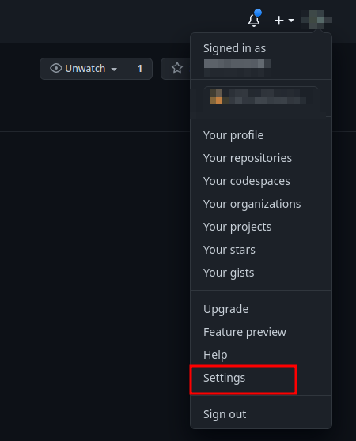

# CCProj-OAuth-App

## Set up GitHub OAuth Application

To test this project, you will be using GitHub to authenticate a web application. Before starting the code, register an OAuth application in GitHub. If you need a GitHub account, [sign up here](https://github.com/signup?ref_cta=Sign+up).

If you already have an account, or once you have registered, navigate to your GitHub "Settings" page by clicking on your icon (in the top right by default);

Once in settings, choose "Developer Settings" in the sidebar:

From there, select "OAuth Apps" in the sidebar of the Developer settings page. Click the button to `Register a new GitHub App` button.

Lastly, fill out the form with following information:

- Application Name: choose any name
- Homepage URL: `http://localhost:3000`
-  Authorization Callback URL: `http://localhost:3000/auth/github/callback
  

Click "Register application"

Take note of the Client ID. Click on "Generate a new client secret" to create a Client secret. Copy both the `Client Id` and `Client secret` and paste them into a secure text file. These will be used in the application you are creating. These keys are only displayed once, when you navigate away from the page, you will no longer be able to see the `Client Secret`.

Once you have this, you are ready to use GitHub for authentication.